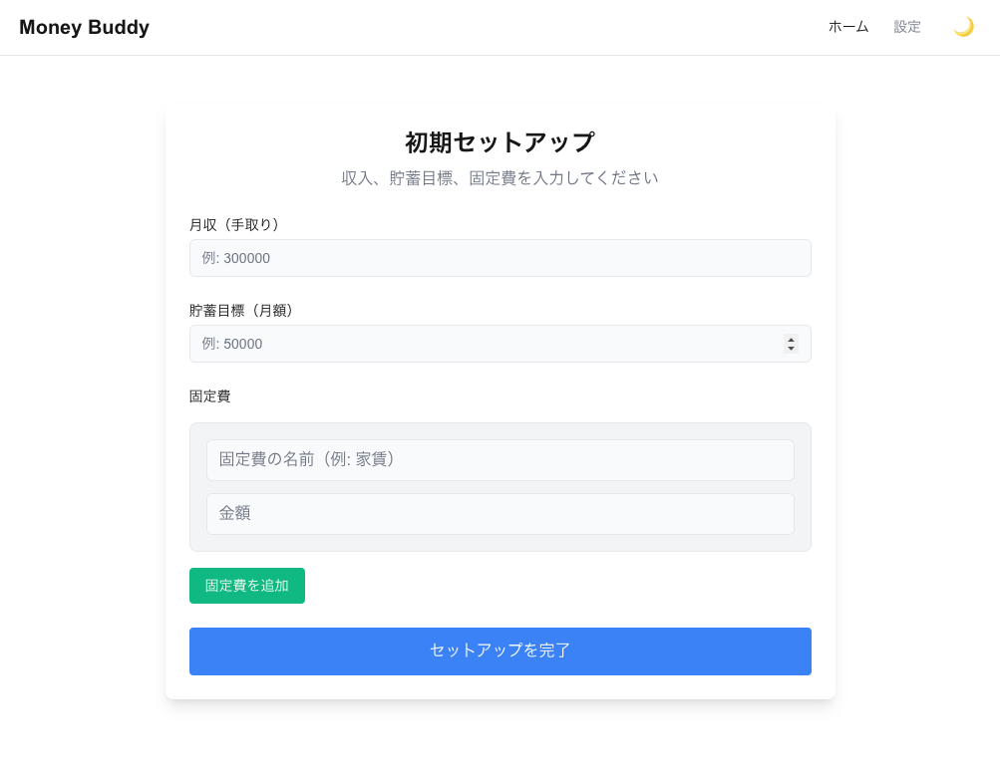
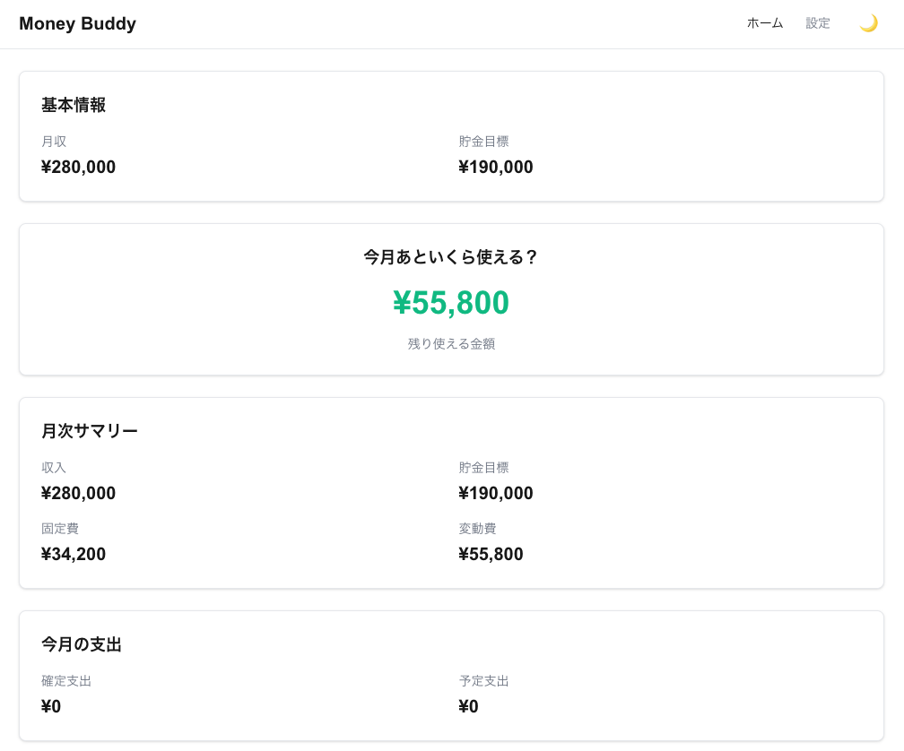
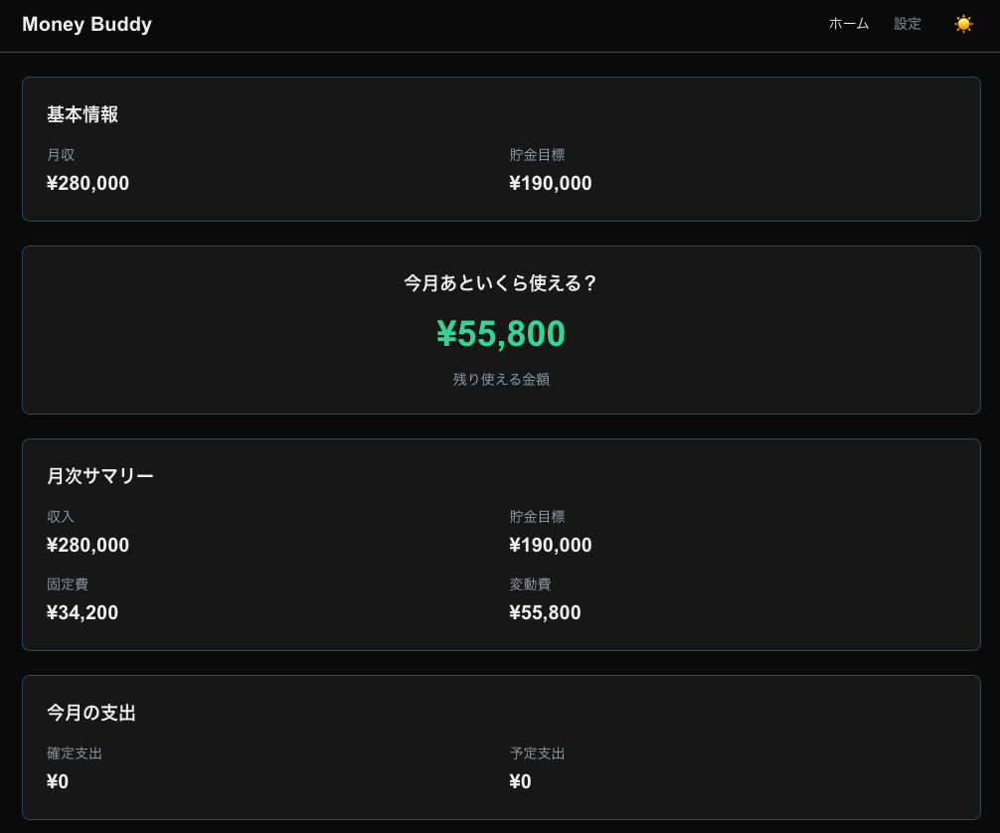
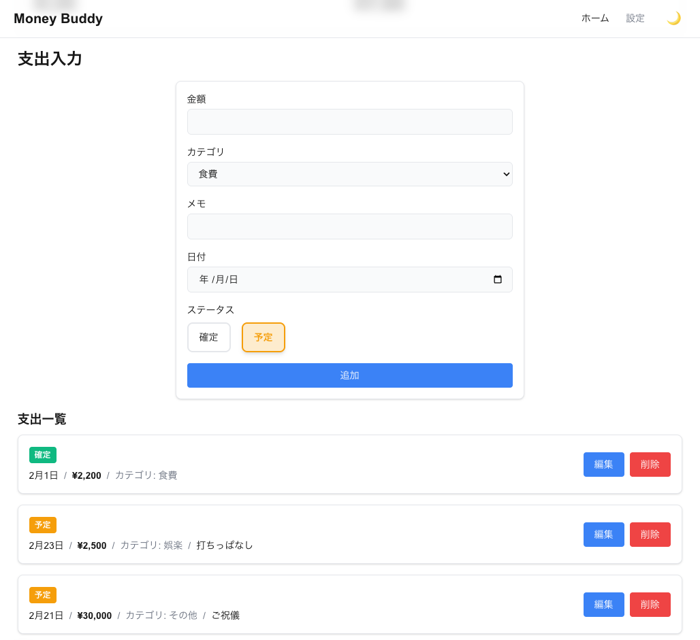
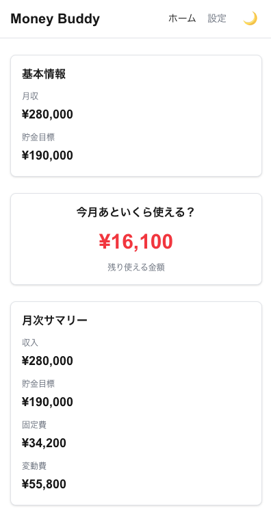
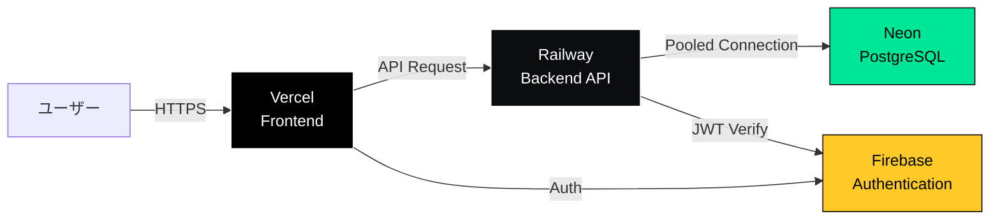
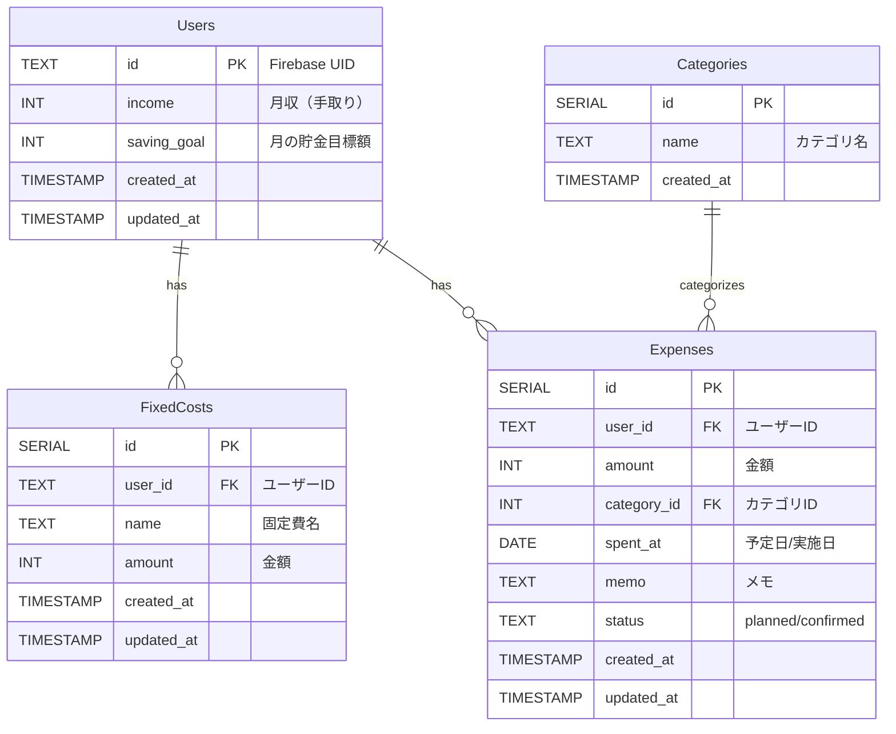

# Money Buddy

[](https://money-buddy-app.vercel.app)
[](https://money-buddy-production.up.railway.app/health)
[](https://neon.tech)

> 💡 **Live Demo**: [https://money-buddy-app.vercel.app](https://money-buddy-app.vercel.app)

## プロジェクト概要

**Money Buddy** は、「お金が貯まらない人が"貯まる生活"を続けられるように伴走する家計管理アプリ」です。

### コンセプト

「今の自分のお金の状況が一目でわかるアプリ」をコンセプトに、シンプルな入力とリアルタイムの残額表示により、貯まる行動を自然に習慣化することを目指しています。

### ターゲットユーザー

- お金の現状把握が苦手な方
- 計画立てが苦手な方
- 家計簿が続かない方
- 今いくら使えるかがすぐに分からない方

### 主な価値提供

アプリを開くたびに「あといくら使っていいか」が一目でわかり、無意識のうちに"貯まる生活"へ変わることを目指しています。

---

## 主な機能

### 実装済み機能 ✅

#### 1. 初期設定機能
- ユーザー登録（月収、貯金目標額の設定）
- 固定費の登録・管理
- 自由に使える変動費の自動計算（変動費 = 収入 - 固定費 - 貯金額）

#### 2. ダッシュボード機能
- **リアルタイム残額表示**
  - 今月の自由に使える残額を大きく表示
  - 残額計算ルール：`残額 = 変動費 - (確定支出 + 予定支出)`
  - 残額に応じた色分け表示（緑: 70%以上 / 黄: 30-70% / 赤: 30%未満）
- **月次サマリー**
  - 収入、貯金目標、固定費、変動費の一覧表示
  - 確定支出・予定支出の集計表示
- **レスポンシブデザイン**
  - モバイル、タブレット、デスクトップに最適化されたレイアウト

#### 3. 支出管理機能
- **支出の登録**
  - 金額、日付、カテゴリ、メモの入力
  - 支出ステータスの管理（予定 / 確定）
  - 予定支出：旅行・飲み会・イベントなど、これから発生する概算支出を事前登録
  - 確定支出：実際に使った金額
- **支出の更新**
  - 予定支出から確定支出への更新
  - 金額・カテゴリ・メモの編集
  - ステータス変更ルール：予定 → 確定は許可、確定 → 予定は禁止
  - カード型トグルUIで直感的なステータス切り替え
- **支出の削除**
- **支出一覧の表示**
  - ステータス別（確定/予定）の色分け表示
  - 編集・削除機能への簡単なアクセス

#### 4. カテゴリ管理
- デフォルトカテゴリの提供（食費、交通費、娯楽費など）
- カテゴリ一覧の取得

#### 5. 認証・セキュリティ機能
- **Firebase Authentication**
  - メール/パスワード認証
  - Googleログイン（OAuth）
  - JWT ID Tokenベースの認証
- **セキュリティ対策**
  - 認証ミドルウェアによるAPIの保護
  - 401エラー時の自動ログアウト
  - ユーザーID検証
  - ログマスキング（トークン情報を非表示）
  - オープンリダイレクト対策
  - CORS設定（動的オリジン検証）
- **UX機能**
  - 認証ガード（ロード中の表示）
  - 保護されたルート
  - ログイン後のリダイレクト
  - セッション期限切れの通知

#### 6. UI/UX機能
- **ダークモード**
  - ライトモード/ダークモードの切り替え
  - システム設定への対応
  - ユーザー設定の永続化（localStorage）
- **デザインシステム**
  - Tailwind CSS 4によるモダンなデザイン
  - セマンティックカラートークンによる一貫したテーマ
  - アクセシビリティを考慮した色彩設計（WCAG AA準拠）

### 今後実装予定（MVP後）📋

- カテゴリ別支出サマリー・詳細分析
- 月別の比較グラフ・トレンド分析
- 無駄遣いアラート・通知機能
- 収支レポート（PDF生成など）
- カスタムカテゴリの作成・編集
- 固定費の編集・削除機能
- 今日までの利用ペースとの比較機能
- プロフィール管理機能
- モバイルアプリ（Expo / React Native）開発

---

## スクリーンショット

### 初期設定画面

_初回起動時に月収・貯金目標・固定費を設定_

### ダッシュボード（ライトモード）

_今月の残額と月次サマリーを一目で確認_

### ダッシュボード（ダークモード）

_目に優しいダークモード対応_

### 支出入力・一覧画面

_シンプルな入力フォームと見やすい支出一覧_

### モバイル表示


_スマートフォンでも快適に操作可能_

---

## 使い方

### 1. 初期設定
初回起動時に以下の情報を入力します：
- **月収（手取り）**: 毎月の収入額
- **貯金目標額**: 毎月貯めたい金額
- **固定費**: 家賃、光熱費、通信費など毎月必ず発生する支出

これらを入力すると、自動的に**変動費（自由に使えるお金）**が計算されます。

### 2. ダッシュボードで残額確認
ホーム画面では以下の情報が表示されます：
- **今月あといくら使える？**: 大きく表示される残額（色で危険度を判断）
  - 🟢 緑: 余裕あり（70%以上残っている）
  - 🟡 黄: 注意（30-70%残っている）
  - 🔴 赤: 危険（30%未満、またはマイナス）
- **月次サマリー**: 収入、貯金目標、固定費、変動費
- **今月の支出**: 確定済みと予定の支出額

### 3. 支出の登録
「支出を追加」から以下を入力：
- **金額**: 使った（または使う予定の）金額
- **カテゴリ**: 食費、交通費、娯楽費など
- **日付**: 支出の日付
- **メモ**: 任意で詳細を記録
- **ステータス**: 確定（実際に使った）or 予定（これから使う）

**予定支出の活用例：**
- 来週の飲み会（3,000円）
- 月末の旅行（30,000円）
- 友人の誕生日プレゼント（5,000円）

事前に予定支出を登録しておくことで、「今使えるお金」がより正確に把握できます。

### 4. 支出の管理
- **編集**: 予定支出を確定に変更したり、金額を修正
- **削除**: 不要な支出を削除
- **一覧表示**: 全ての支出を確認、ステータス別に色分け表示

---

## 技術的な特徴

### アーキテクチャ
- **フロントエンド**: Next.js 16 App Router + React 19による高速なSPA
- **バックエンド**: Go + Ginによる高パフォーマンスなREST API
- **データベース**: PostgreSQLでリレーショナルデータを安全に管理
- **型安全性**: TypeScript（フロントエンド）+ sqlc（バックエンド）で完全な型安全を実現

### デザインシステム
- **Tailwind CSS 4**: 最新のユーティリティファーストCSS
- **カラートークン**: セマンティックな色定義で一貫性を確保
  - Primary（プライマリーアクション）
  - Secondary（セカンダリーアクション）
  - Success（成功・緑）
  - Warning（警告・黄）
  - Danger（危険・赤）
- **レスポンシブデザイン**: モバイルファースト設計
  - Mobile: ~640px
  - Tablet: 640px~1024px
  - Desktop: 1024px~

### UX設計の工夫
- **直感的な残額表示**: 数字だけでなく色でも危険度を伝達
- **予定支出機能**: 将来の支出を見越した残額計算
- **ダークモード**: 長時間の利用でも目に優しい
- **カード型トグルUI**: タップしやすい大きなボタンで操作性向上
- **リアルタイム更新**: 支出の追加・編集後すぐにダッシュボードに反映

---

## 技術スタック

### フロントエンド（Web）
- **フレームワーク**: Next.js 16 (App Router)
- **ライブラリ**: React 19
- **言語**: TypeScript
- **スタイリング**: Tailwind CSS 4
- **Linter**: ESLint
- **テスト**: Jest

### バックエンド（API）
- **言語**: Go 1.25
- **Webフレームワーク**: Gin
- **データベース**: PostgreSQL
- **データベースドライバー**: pgx/v5（Neon Serverless PostgreSQL対応）
- **クエリビルダー**: sqlc（型安全なSQL生成）
- **テストフレームワーク**: testify
- **API仕様**: OpenAPI 3.0
- **認証**: Firebase Admin SDK（JWT検証）

### インフラ構成（本番環境）



#### デプロイ環境の選定理由

**フロントエンド: Vercel**
- Next.js公式推奨プラットフォーム
- GitHubとの自動連携で即座にデプロイ
- グローバルCDNによる高速配信
- プレビューデプロイで本番前の動作確認が容易

**バックエンド: Railway**
- Dockerコンテナを直接デプロイ可能
- GitHubとの自動連携
- 環境変数の管理が直感的
- 無料枠でも十分な性能（512MB RAM, 0.5 vCPU）

**データベース: Neon（Serverless PostgreSQL）**
- サーバーレスアーキテクチャで自動スケール
- 使用量ベースの課金で開発コスト削減
- コネクションプーリング標準搭載
- ブランチ機能で開発環境の複製が容易
- Railwayとの相性が良い（低レイテンシー）

**認証: Firebase Authentication**
- 手軽に実装できる認証基盤
- Google OAuthなど複数の認証方式をサポート
- JWTトークンによるステートレス認証
- 無料枠が充実

### データベース
- **本番**: Neon Serverless PostgreSQL
  - バージョン: PostgreSQL 16
  - 接続方式: Pooled Connection（推奨）
  - コネクションプール: 最大10接続
  - オートサスペンド: 5分（無料プラン）
- **開発**: ローカルPostgreSQL 14以上


### 将来的な拡張
- **モバイル**: Expo (React Native)
- **分析基盤**: BigQuery / Looker Studio
- **本格的なインフラ**: AWS (ECS / RDS / S3) or GCP

---

## ディレクトリ構造

```
.
├── .github/
│   └── copilot-instructions.md  # GitHub Copilot設定
├── docs/
│   └── images/                   # スクリーンショット
├── backend/                      # バックエンド（Go API）
│   ├── cmd/
│   │   └── server/
│   │       └── main.go           # サーバーエントリーポイント
│   ├── db/
│   │   ├── schema/               # DDL（テーブル定義）
│   │   │   ├── users.sql
│   │   │   ├── fixed_costs.sql
│   │   │   ├── expenses.sql
│   │   │   └── categories.sql
│   │   ├── query/                # SQLクエリ（sqlc用）
│   │   │   ├── users.sql
│   │   │   ├── fixed_costs.sql
│   │   │   ├── expenses.sql
│   │   │   ├── categories.sql
│   │   │   └── dashboard.sql
│   │   ├── generated/            # sqlc自動生成コード
│   │   │   ├── db.go
│   │   │   ├── models.go
│   │   │   └── *.sql.go
│   │   └── sqlc.yaml
│   ├── internal/                 # プライベートパッケージ
│   │   ├── auth/                 # Firebase認証初期化
│   │   ├── db/                   # DB接続・トランザクション
│   │   ├── handlers/             # HTTPハンドラ層
│   │   │   ├── expense_handler.go
│   │   │   ├── dashboard_handler.go
│   │   │   └── ...
│   │   ├── middleware/           # 認証ミドルウェア
│   │   ├── models/               # ドメインモデル
│   │   ├── repositories/         # リポジトリインターフェース
│   │   └── services/             # ビジネスロジック層
│   ├── infra/                    # インフラ層実装
│   │   ├── repository/           # リポジトリ実装（sqlc）
│   │   └── transaction/          # トランザクション管理
│   ├── openapi/
│   │   └── openapi.yaml          # OpenAPI 3.0仕様
│   ├── Dockerfile                # 本番環境用コンテナ
│   ├── .dockerignore
│   ├── .env.example              # 環境変数テンプレート
│   ├── ENV_SETUP.md              # セットアップガイド
│   ├── go.mod
│   └── go.sum
│
└── frontend/                     # フロントエンド（Next.js）
    ├── src/
    │   ├── app/                  # Next.js App Router
    │   │   ├── page.tsx          # ダッシュボード画面
    │   │   ├── layout.tsx        # ルートレイアウト
    │   │   ├── login/            # ログイン画面
    │   │   ├── settings/         # 設定画面
    │   │   └── globals.css
    │   ├── components/           # UIコンポーネント
    │   │   ├── Dashboard.tsx     # ダッシュボード
    │   │   ├── ExpenseForm.tsx   # 支出フォーム
    │   │   ├── ExpenseList.tsx   # 支出一覧
    │   │   ├── FixedCostForm.tsx # 固定費フォーム
    │   │   ├── InitialSetupForm.tsx # 初期設定
    │   │   ├── Layout/           # レイアウト
    │   │   │   ├── Header.tsx
    │   │   │   ├── AuthGuard.tsx
    │   │   │   └── Container.tsx
    │   │   └── ui/               # 共通UIパーツ
    │   ├── contexts/             # Reactコンテキスト
    │   │   └── AuthContext.tsx  # 認証状態管理
    │   ├── hooks/                # カスタムフック
    │   │   ├── useExpenses.ts
    │   │   ├── useUser.ts
    │   │   ├── useDashboard.ts
    │   │   └── useTheme.ts       # ダークモード
    │   └── lib/                  # ユーティリティ
    │       ├── api/              # APIクライアント（7ファイル）
    │       │   ├── client.ts     # 共通設定・エラーハンドリング
    │       │   ├── expenses.ts
    │       │   ├── categories.ts
    │       │   ├── dashboard.ts
    │       │   └── ...
    │       ├── firebase/
    │       │   └── config.ts     # Firebase初期化
    │       └── types/            # TypeScript型定義
    ├── public/
    ├── .env.local.example        # 環境変数テンプレート
    ├── package.json
    ├── tsconfig.json
    ├── next.config.ts
    ├── tailwind.config.ts
    └── jest.config.js
```

---

## セットアップ / 実行方法

### 前提条件

- **Go**: 1.25以上
- **Node.js**: 20以上
- **PostgreSQL**: 14以上
- **sqlc**: sqlcのインストール（バックエンド開発に必要）

### データベースセットアップ

1. PostgreSQLデータベースを作成します：

```bash
createdb money_buddy
```

2. スキーマを適用します：

```bash
cd backend
psql -d money_buddy -f db/schema/users.sql
psql -d money_buddy -f db/schema/categories.sql
psql -d money_buddy -f db/schema/fixed_costs.sql
psql -d money_buddy -f db/schema/expenses.sql
```

3. 環境変数を設定します（`backend/.env` ファイルを作成）：

```bash
# データベース接続
DATABASE_DSN=host=localhost port=5432 user=postgres password=yourpassword dbname=money_buddy sslmode=disable

# Firebase認証（どちらか一方を設定）
# 方法1: 認証情報ファイルのパス（開発環境推奨）
FIREBASE_CREDENTIALS_PATH=./firebase-admin-key.json

# 方法2: JSON文字列（本番環境推奨）
# FIREBASE_CREDENTIALS_JSON={"type":"service_account",...}

# CORS設定（カンマ区切りで複数指定可能）
ALLOWED_ORIGINS=http://localhost:3000

# サーバーポート
PORT=8080

# 環境（development or production）
ENV=development
```

4. Firebase Admin SDKの認証情報を取得：
   - [Firebase Console](https://console.firebase.google.com/) でプロジェクトを作成
   - プロジェクト設定 → サービスアカウント → 新しい秘密鍵の生成
   - ダウンロードしたJSONファイルを `backend/firebase-admin-key.json` として保存

### バックエンドの起動

```bash
cd backend

# 依存関係のインストール
go mod download

# サーバー起動（デフォルトポート: 8080）
go run cmd/server/main.go
```

### フロントエンドの起動

1. 環境変数を設定します（`frontend/.env.local` ファイルを作成）：

```bash
# APIベースURL
NEXT_PUBLIC_API_BASE_URL=http://localhost:8080

# Firebase設定（Firebase Consoleから取得）
NEXT_PUBLIC_FIREBASE_API_KEY=your-api-key
NEXT_PUBLIC_FIREBASE_AUTH_DOMAIN=your-project.firebaseapp.com
NEXT_PUBLIC_FIREBASE_PROJECT_ID=your-project-id
NEXT_PUBLIC_FIREBASE_STORAGE_BUCKET=your-project.appspot.com
NEXT_PUBLIC_FIREBASE_MESSAGING_SENDER_ID=123456789
NEXT_PUBLIC_FIREBASE_APP_ID=1:123456789:web:abcdef
```

2. 依存関係のインストールとサーバー起動：

```bash
cd frontend

# 依存関係のインストール
npm install

# 開発サーバー起動（デフォルトポート: 3000）
npm run dev
```

3. ブラウザで `http://localhost:3000` にアクセス
4. 初回アクセス時はログイン/サインアップ画面が表示されます

---

## API仕様

API仕様は OpenAPI 3.0 形式で定義されています。詳細は [backend/openapi/openapi.yaml](backend/openapi/openapi.yaml) をご参照ください。

### ベースURL
```
http://localhost:8080
```

### 認証

全てのAPIエンドポイントは認証が必要です。リクエストヘッダーに以下を含める必要があります：

```
Authorization: Bearer <Firebase ID Token>
```

### エンドポイント一覧

#### 支出管理 (Expenses)
| メソッド | エンドポイント | 説明 |
|---------|--------------|------|
| POST | `/expenses` | 支出の登録 |
| GET | `/expenses` | 支出一覧の取得 |
| PUT | `/expenses/:id` | 支出の更新 |
| DELETE | `/expenses/:id` | 支出の削除 |

#### カテゴリ管理 (Categories)
| メソッド | エンドポイント | 説明 |
|---------|--------------|------|
| GET | `/categories` | カテゴリ一覧の取得 |

#### ユーザー管理 (Users)
| メソッド | エンドポイント | 説明 |
|---------|--------------|------|
| GET | `/user/me` | 現在のユーザー情報の取得 |

#### 初期設定 (Setup)
| メソッド | エンドポイント | 説明 |
|---------|--------------|------|
| POST | `/setup` | 初期設定の完了（ユーザー作成 + 固定費登録） |

#### ダッシュボード (Dashboard)
| メソッド | エンドポイント | 説明 |
|---------|--------------|------|
| GET | `/dashboard` | ダッシュボードデータの取得 |

### 主要なリクエスト/レスポンス例

#### 支出の登録 (POST /expenses)
**リクエスト:**
```json
{
  "amount": 3000,
  "category_id": 1,
  "memo": "ランチ",
  "spent_at": "2026-02-11",
  "status": "confirmed"
}
```

**レスポンス (201 Created):**
```json
{
  "expense": {
    "id": 1,
    "amount": 3000,
    "category": {
      "id": 1,
      "name": "食費"
    },
    "memo": "ランチ",
    "spent_at": "2026-02-11T00:00:00Z",
    "status": "confirmed"
  }
}
```

#### 支出一覧の取得 (GET /expenses)
**レスポンス (200 OK):**
```json
{
  "expenses": [
    {
      "id": 1,
      "amount": 3000,
      "category": {
        "id": 1,
        "name": "食費"
      },
      "memo": "ランチ",
      "spent_at": "2026-02-11T00:00:00Z",
      "status": "confirmed"
    }
  ]
}
```

#### ダッシュボードデータの取得 (GET /dashboard)
**レスポンス (200 OK):**
```json
{
  "income": 300000,
  "saving_goal": 50000,
  "fixed_costs": 150000,
  "variable_budget": 100000,
  "confirmed_expenses": 30000,
  "planned_expenses": 10000,
  "remaining": 60000
}
```

**フィールド説明:**
- `income`: 月収（手取り）
- `saving_goal`: 貯金目標額
- `fixed_costs`: 固定費の合計
- `variable_budget`: 変動費（自由に使えるお金）= income - saving_goal - fixed_costs
- `confirmed_expenses`: 確定済み支出の合計
- `planned_expenses`: 予定支出の合計
- `remaining`: 残額 = variable_budget - confirmed_expenses - planned_expenses

#### 初期設定 (POST /setup)
**リクエスト:**
```json
{
  "user": {
    "id": "user123",
    "income": 300000,
    "saving_goal": 50000
  },
  "fixed_costs": [
    {
      "name": "家賃",
      "amount": 80000
    },
    {
      "name": "光熱費",
      "amount": 15000
    }
  ]
}
```

**レスポンス (200 OK):**
```json
{
  "user": {
    "id": "user123",
    "income": 300000,
    "saving_goal": 50000,
    "created_at": "2026-02-11T10:00:00Z",
    "updated_at": "2026-02-11T10:00:00Z"
  },
  "fixed_costs": [
    {
      "id": 1,
      "user_id": "user123",
      "name": "家賃",
      "amount": 80000,
      "created_at": "2026-02-11T10:00:00Z",
      "updated_at": "2026-02-11T10:00:00Z"
    },
    {
      "id": 2,
      "user_id": "user123",
      "name": "光熱費",
      "amount": 15000,
      "created_at": "2026-02-11T10:00:00Z",
      "updated_at": "2026-02-11T10:00:00Z"
    }
  ]
}
```

### ビジネスルール

#### 支出ステータスの遷移ルール
- **許可**: `planned` (予定) → `confirmed` (確定)
- **禁止**: `confirmed` (確定) → `planned` (予定)

確定済みの支出を予定に戻すことはできません。これは実際に使ったお金を「使っていないことにする」ことを防ぐためです。

### エラーレスポンス

全てのエラーは以下の形式で返されます：

```json
{
  "error": "エラーメッセージ"
}
```

**HTTPステータスコード:**
- `400 Bad Request`: バリデーションエラー、無効なステータス遷移
- `404 Not Found`: リソースが見つからない（ユーザー未登録など）
- `422 Unprocessable Entity`: ビジネスロジックエラー
- `500 Internal Server Error`: サーバー内部エラー

---

## データモデル

### ER図

データベース設計はシンプルさと拡張性のバランスを重視しました。Firebase UIDを主キーに採用することで、認証基盤とシームレスに統合しています。



### テーブル詳細

### Users（ユーザー）
| フィールド | 型 | 説明 |
|-----------|-----|------|
| id | TEXT | Firebase UID（主キー） |
| income | INT | 月収（手取り） |
| saving_goal | INT | 月の貯金目標額 |
| created_at | TIMESTAMP | 作成日時 |
| updated_at | TIMESTAMP | 更新日時 |

### FixedCosts（固定費）
| フィールド | 型 | 説明 |
|-----------|-----|------|
| id | SERIAL | 主キー |
| user_id | TEXT | ユーザーID（外部キー） |
| name | TEXT | 固定費名（例: 家賃、光熱費） |
| amount | INT | 金額 |
| created_at | TIMESTAMP | 作成日時 |
| updated_at | TIMESTAMP | 更新日時 |

### Expenses（支出）
| フィールド | 型 | 説明 |
|-----------|-----|------|
| id | SERIAL | 主キー |
| user_id | TEXT | ユーザーID（外部キー） |
| amount | INT | 金額（概算 or 実額） |
| category_id | INT | カテゴリID |
| spent_at | DATE | 予定日 or 実施日 |
| memo | TEXT | メモ（任意） |
| status | TEXT | ステータス（planned / confirmed） |
| created_at | TIMESTAMP | 作成日時 |
| updated_at | TIMESTAMP | 更新日時 |

### Categories（カテゴリ）
| フィールド | 型 | 説明 |
|-----------|-----|------|
| id | SERIAL | 主キー |
| name | TEXT | カテゴリ名 |
| created_at | TIMESTAMP | 作成日時 |

---

## 開発

### バックエンド

#### テストの実行

```bash
cd backend
go test ./...
```

#### sqlcによるコード生成

スキーマやクエリを変更した場合は、sqlcで型安全なコードを再生成します：

```bash
cd backend
sqlc generate
```

### フロントエンド

#### テストの実行

```bash
cd frontend
npm test
```

#### Lintの実行

```bash
cd frontend
npm run lint
```

#### ビルド

```bash
cd frontend
npm run build
```

---

## プロジェクトの状態

本プロジェクトは**MVP（Minimum Viable Product）が完成**した段階です。

### ✅ 完成している機能
- **認証システム**（Firebase Auth: メール/パスワード、Google OAuth）
- **セキュリティ対策**（JWT検証、自動ログアウト、ログマスキング、CORS設定）
- 初期設定フロー（収入・貯金・固定費の設定）
- ダッシュボード（残額表示、月次サマリー、色分け表示）
- 支出の登録・更新・削除
- 予定支出と確定支出の管理
- カテゴリ管理
- ダークモード
- フルレスポンシブデザイン
- リアルタイム更新

### 🚧 開発中・今後の拡張
- カテゴリ別支出の詳細分析
- 月別トレンド分析・グラフ機能
- モバイルアプリ版（React Native）
- プロフィール管理機能

### 動作確認済み環境
- **ブラウザ**: Chrome, Safari, Firefox（最新版）
- **デバイス**: PC、タブレット、スマートフォン
- **OS**: macOS, Windows, iOS, Android

---

## 開発のこだわりポイント

### 1. ユーザー体験重視
- 「今いくら使えるか」を最優先で表示
- 予定支出機能で将来を見越した管理
- 色による直感的な危険度の可視化

### 2. 継続しやすい設計
- 最小限の入力項目（金額・日付・カテゴリのみ必須）
- ステータス切替のシンプルなUI
- モバイルでも快適な操作性

### 3. セキュリティ・プライバシー
- Firebase Authenticationによる安全な認証
- JWT検証によるAPIの保護
- 自動ログアウトによるセッション管理
- ログマスキングによる情報漏洩防止
- CORS設定による不正アクセス防止
- オープンリダイレクト対策

### 4. 技術的な堅牢性
- TypeScript + sqlcによる完全な型安全性
- PostgreSQLによる信頼性の高いデータ管理
- OpenAPI仕様書によるAPI設計の透明性
- テストコード完備（Go: testify, フロントエンド: Jest）
- 本番環境を想定した設定管理

### 5. 拡張性
- クリーンアーキテクチャ（レイヤー分離）
- 依存性注入によるテスタビリティ
- 認証機能の追加を想定した設計
- モバイルアプリへの展開を見据えたAPI設計

---

## ライセンス

本プロジェクトのライセンスは未定です。

---

## 貢献

現在、本プロジェクトは個人開発中です。

---

## お問い合わせ

プロジェクトに関するご質問は、GitHubのIssuesよりお願いいたします。
